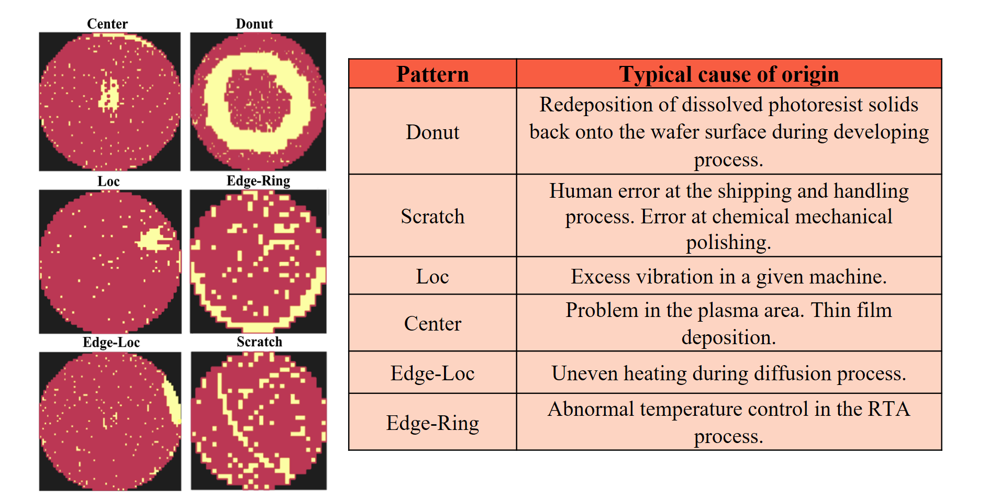
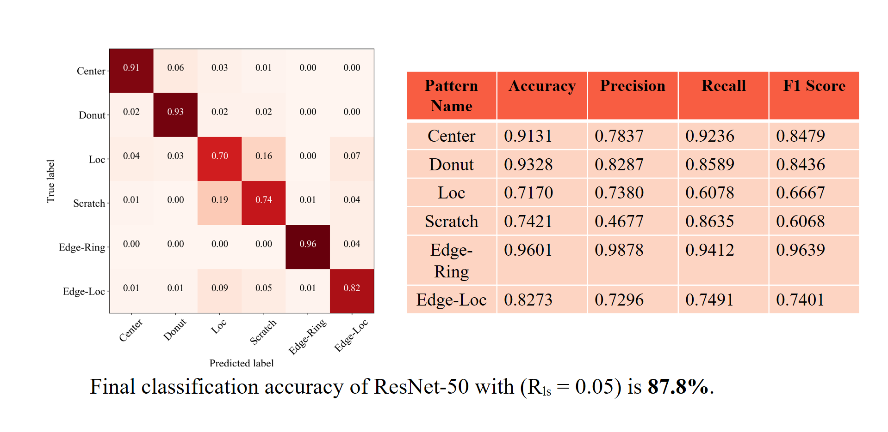

# Classification of Wafer Maps Defect Based on Deep Learning Methods With Small Amount of Data

IEEE 6th International Conference Engineering & Telecommunication – En&T-2019

## Introduction: The Purpose of the Research

Improvement of the quality of pattern recognition method in conditions of a deficient amount of labeled experimental data

## Work Accomplished
- Method of preparing the composite training dataset:
  - review of typical manufacturing causes of defect patterns;
  - procedure of synthesized wafer maps creation;
  - adaptive configuration of training dataset.

- New learning DCNN strategy:
  - pretrain stage on pure synthetic dataset;
  - main train stage on composite dataset.

- Numerical calculations and results:
  - DCNN model training: VGG-19, ResNet-50, ResNet-34 and MobileNetV2;
  - experimental comparison of models accuracy on different conditions;
  - dependence of classification accuracy on amount of experimental data.

## Review of Typical Manufacturing Causes

[Source of experimental data](mirlab.org/dataSet/public/WM-811K.zip)

## Synthesis of Wafer Maps

## Experimental Comparison

## Accuracy Specification of the Top DCNN Model

## Conclusion

- Proposal of the method of preparing the composite training dataset

- Development of the new learning DCNN model strategy which improve the final result of accuracy by 1% up to 4%

- Experimental accuracy comparison of VGG-19, ResNet-50, ResNet-34 and MobileNetV2 DCNN models for the different ratio of experimental labeled data to synthesized data

- Achievement of 87.8% final classification accuracy with Rₗₛ = 0.05 on the public dataset WM-811K by ResNet-50

- Formative evaluation of needed amount of experimental data to obtain required accuracy  
