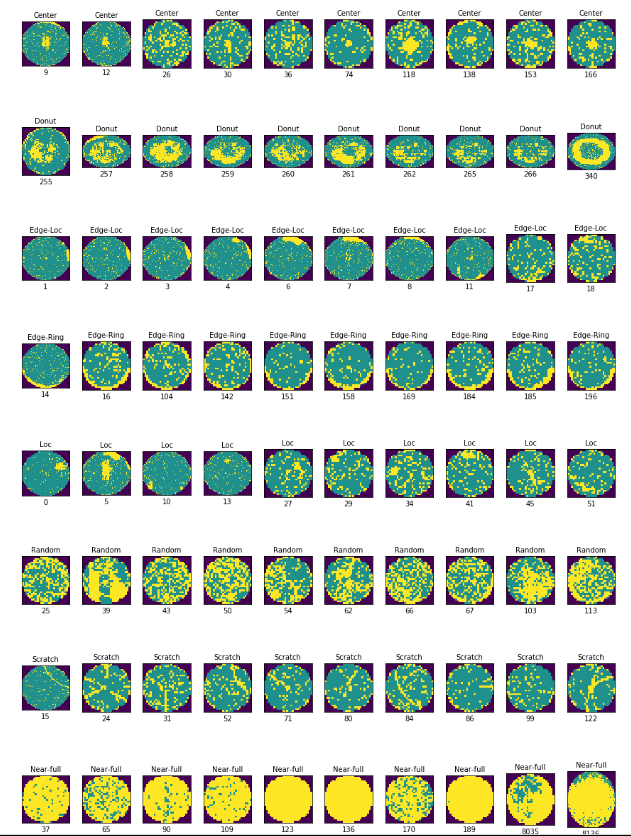

# Поиск паттернов на wafer maps на примере датасета WM-811K
<h3 id="Introduction"> Data Introduction </h3>

WM-811K $-$ это наборы данных полупроводников, которые можно загрузить с [Kaggle](https://www.kaggle.com/qingyi/wm811k-wafer-map).

В полупроводниках существует много проблем, связанных с процессом, и шаблон вафельной карты из CP Yield, WAT (Wafer Acceptance Test).

Но есть большая проблема в том, как классифицировать шаблон вафельной карты на несколько групп без ручного действия. Есть много работ, чтобы рассмотреть эту проблему, и здесь я покажу результат применения глубокого обучения.

В данных содержится 811457 изображений, но только 172950 изображений с ручной меткой (всего 9 меток: 0,1,2,3,4,5,6,7,8).

 Из 172950 изображений метка: 8 (none-pattern) заняла 85,2%. 

Остальные паттерны (14.8%) распределились таким образом:

0. Center :   4294(2.5%) 

1. Donut :    555(0.3%) 

2. Edge-Loc : 5189(3.0%)

3. Edge-Ring : 9680(5.6%) 

4. Loc :      3593(2.1%)

5. Random :   866(0.5%) 

6. Scratch :  1193(0.7%)

7. Near-full : 149(0.1%)

Ссылка :

1. https://www.kaggle.com/qingyi/wm811k-wafer-map/discussion/57318#latest-338421
